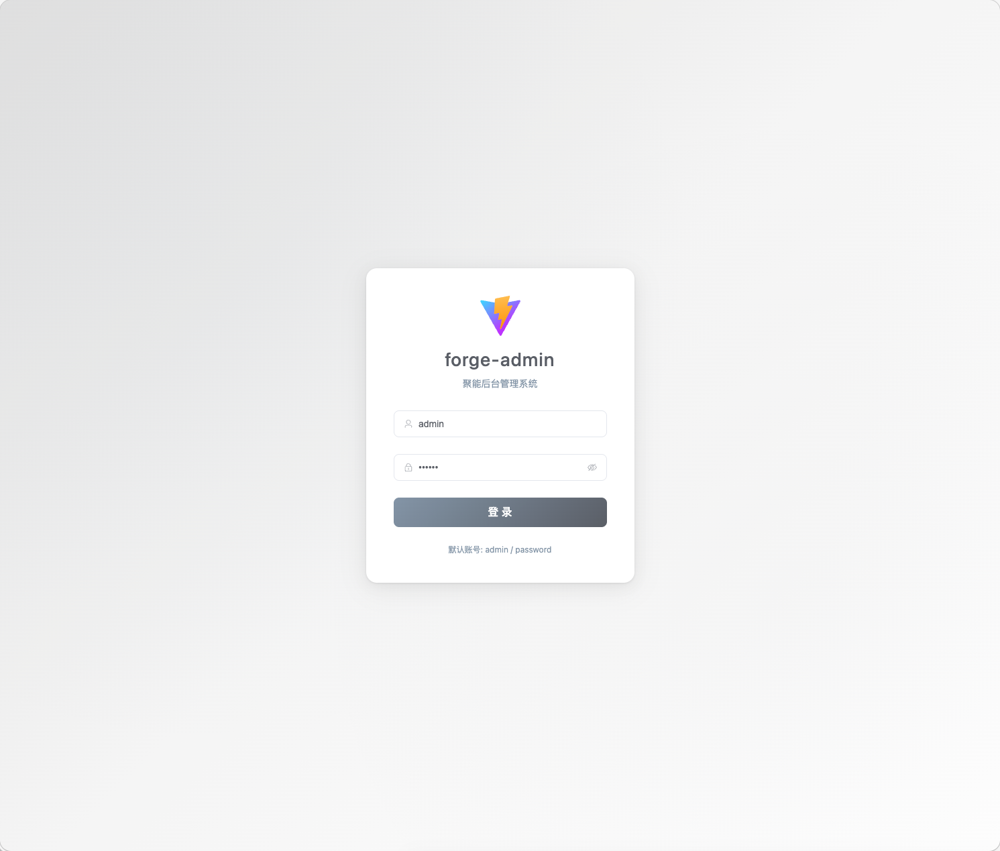
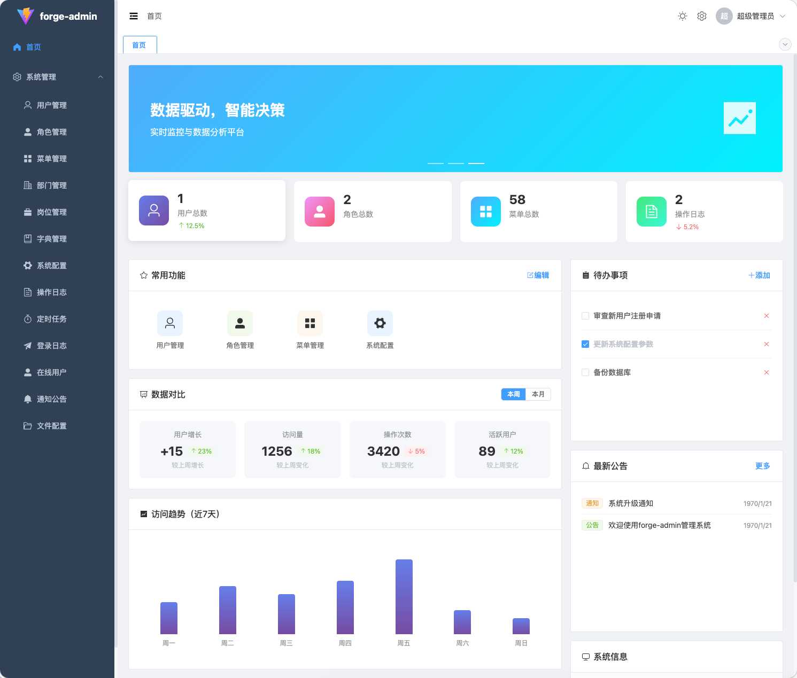
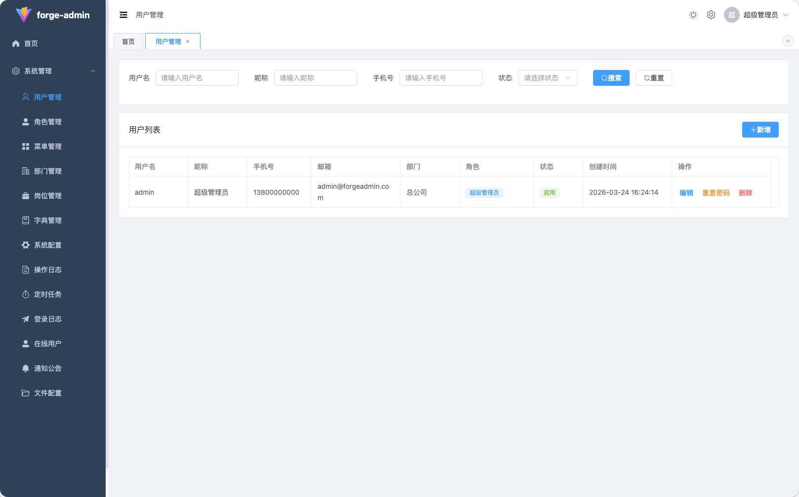
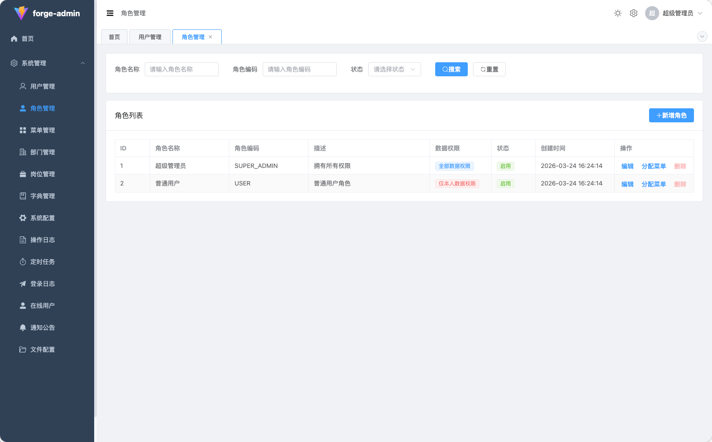
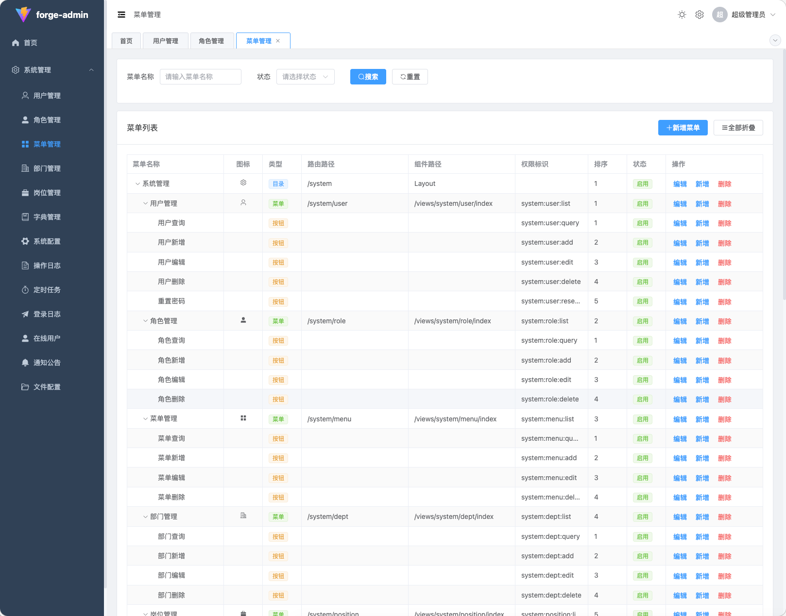

# forge-admin

企业级后台管理系统模板，基于 RBAC（基于角色的访问控制）权限模型，开箱即用。

## 项目简介

forge-admin 是一款现代化的企业级后台管理解决方案，采用前后端分离架构设计。后端基于 Spring Boot 3.2 构建，使用 MyBatis Plus 简化数据操作，JWT 实现无状态认证；前端采用 Vue 3 + TypeScript + Element Plus 技术栈，提供流畅的用户体验和完善的类型支持。

系统内置完整的权限管理模块，支持用户、角色、菜单、部门的层级管理，并实现细粒度的数据权限控制（全部/本部门/本部门及以下/仅本人）。集成 Quartz 定时任务调度、在线 API 文档（Knife4j）、操作日志审计、登录日志等企业级功能。支持 Docker 容器化部署，提供项目模板化工具，可快速基于此项目创建新的管理系统。

## 项目截图

### 登录页面



### 仪表盘



### 用户管理



### 角色管理



### 菜单管理



## 特性

- **权限管理**：完整的 RBAC 权限系统，支持用户、角色、菜单、部门管理
- **数据权限**：支持部门数据权限隔离
- **字典管理**：灵活的数据字典配置
- **定时任务**：基于 Quartz 的定时任务管理
- **文件存储**：支持本地存储，可扩展 OSS 等
- **API 文档**：集成 Knife4j，提供在线 API 文档
- **响应式设计**：支持桌面端和移动端

## 技术栈

### 后端

- Java 21
- Spring Boot 3.2.0
- MyBatis Plus 3.5.7
- MySQL 8.0+
- Redis 6.0+
- JWT 认证
- Knife4j (Swagger)

### 前端

- Vue 3.4
- TypeScript 5.3
- Element Plus 2.4
- Pinia 2.1
- Vite 5.0

## 快速开始

### 环境要求

- JDK 21+
- Node.js 18+ (推荐 22.9.0)
- pnpm 8.15.4+
- MySQL 8.0+
- Redis 6.0+

### 安装

1. **克隆项目**

```bash
git clone <repository-url>
cd forge-admin
```

2. **创建数据库**

```bash
mysql -u root -p < sql/init.sql
```

3. **启动后端**

```bash
cd apps/forge-server
mvn spring-boot:run
```

后端服务将运行在 http://localhost:8180

4. **启动前端**

```bash
cd apps/forge-web
pnpm install
pnpm dev
```

前端服务将运行在 http://localhost:3002

5. **访问系统**

- 前端地址：http://localhost:3002
- API 文档：http://localhost:8180/api/doc.html
- 默认账号：`admin` / `password`

## 目录结构

```
forge-admin/
├── apps/
│   ├── backend/                # 后端应用
│   │   ├── src/
│   │   │   ├── main/
│   │   │   │   ├── java/com/forge/admin/
│   │   │   │   │   ├── common/       # 通用模块
│   │   │   │   │   │   ├── annotation/  # 自定义注解
│   │   │   │   │   │   ├── aspect/      # AOP 切面
│   │   │   │   │   │   ├── config/      # 配置类
│   │   │   │   │   │   ├── exception/   # 异常处理
│   │   │   │   │   │   └── utils/       # 工具类
│   │   │   │   │   └── modules/        # 业务模块
│   │   │   │   │       ├── auth/        # 认证模块
│   │   │   │   │       ├── system/      # 系统管理
│   │   │   │   │       └── quartz/      # 定时任务
│   │   │   │   └── resources/
│   │   │   │       ├── application.yml  # 配置文件
│   │   │   │       └── db/migration/    # 数据库迁移
│   │   │   └── pom.xml
│   │   └── Dockerfile
│   │
│   └── frontend/               # 前端应用
│       ├── src/
│       │   ├── api/            # API 接口
│       │   ├── components/     # 公共组件
│       │   ├── composables/    # 组合式函数
│       │   ├── layouts/        # 布局组件
│       │   ├── router/         # 路由配置
│       │   ├── stores/         # 状态管理
│       │   ├── styles/         # 样式文件
│       │   ├── types/          # 类型定义
│       │   ├── utils/          # 工具函数
│       │   └── views/          # 页面组件
│       ├── package.json
│       └── Dockerfile
│
├── docker/
│   └── nginx.conf              # Nginx 配置
│
├── scripts/
│   └── init-project.js         # 项目初始化脚本
│
├── sql/
│   └── init.sql                # 数据库初始化脚本
│
├── .template/
│   └── template-config.yaml    # 模板配置
│
├── docker-compose.yml
├── .dockerignore
└── .env.example
```

## Docker 部署

### 使用 Docker Compose

1. **配置环境变量**

```bash
cp .env.example .env
# 编辑 .env 文件，配置数据库和 Redis 连接信息
```

2. **启动服务**

```bash
docker-compose up -d
```

3. **访问系统**

- 前端地址：http://localhost
- API 文档：http://localhost/api/doc.html

### 单独构建镜像

```bash
# 构建后端镜像
cd apps/forge-server
docker build -t forge-admin-backend .

# 构建前端镜像
cd apps/forge-web
docker build -t forge-admin-frontend .
```

## 基于模板创建新项目

本项目可作为模板快速创建新项目：

```bash
pnpm run init <项目名称> "<项目描述>" <包名>
```

示例：

```bash
pnpm run init my-admin "我的管理系统" com.mycompany
```

该命令会：
1. 替换 Java 包名（重命名目录和文件）
2. 更新配置文件中的项目名称
3. 更新前端标题和 localStorage keys
4. 更新数据库名

## 开发指南

详细开发指南请参考：

- [项目规范](/.claude/PROJECT.md)
- [模板使用指南](/docs/template-guide.md) - 如何基于本模板创建新项目
- [API 规范](/docs/api-guide.md)

## 配置说明

### 后端配置

主要配置文件：`apps/forge-server/src/main/resources/application.yml`

| 配置项 | 说明 | 默认值 |
|--------|------|--------|
| `server.port` | 服务端口 | 8180 |
| `spring.datasource.url` | 数据库连接 | localhost:3306/forge_admin |
| `spring.data.redis.host` | Redis 主机 | localhost |
| `jwt.secret` | JWT 密钥 | (生产环境请修改) |
| `file.upload-path` | 文件上传路径 | ./uploads |

### 前端配置

环境变量配置：

| 变量 | 说明 | 开发环境 | 生产环境 |
|------|------|----------|----------|
| `VITE_APP_TITLE` | 应用标题 | forge-admin | forge-admin |
| `VITE_API_BASE_URL` | API 地址 | http://localhost:8180/api | /api |

## 许可证

MIT License
